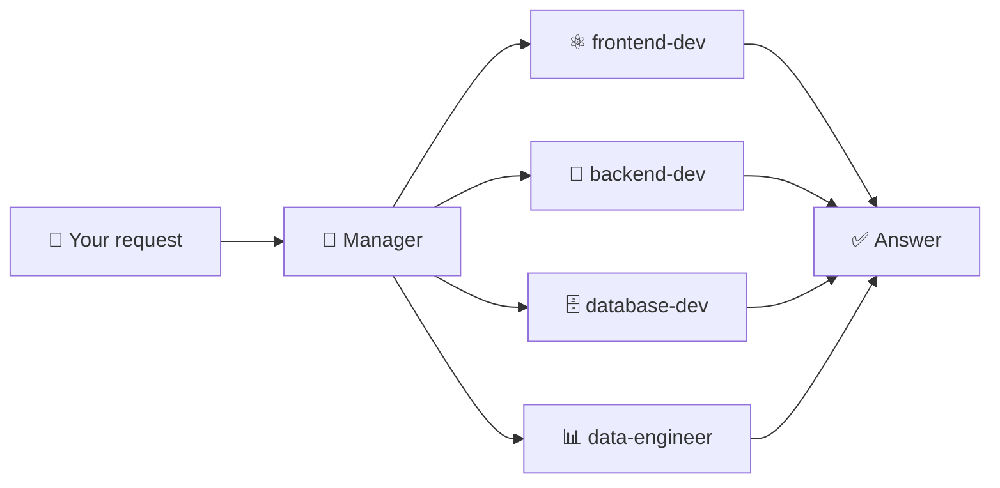

<div align="center">

# ✨ Skills for Cursor

**Role-based agent skills for React · Django · Database · Data**

[](https://cursor.com)
[](https://github.com/Haroon966/SkillsForCursor)
[](./README.md)

*Lightweight role cards so the AI behaves like a focused specialist — not a generic assistant.*

</div>

---

## 🎯 What is this?

This repo contains **Cursor Agent Skills**: short `SKILL.md` files that Cursor reads and follows when you code. Each skill defines:

| | What it covers |
|---|----------------|
| 📌 | **When** to use it (e.g. Django views, DRF, auth) |
| 🧭 | **Principles** — security, structure, conventions |
| 📐 | **Patterns** — how to structure code, APIs, migrations |
| 🔗 | **Links** to related skills (e.g. backend ↔ database) |

> Think of them as **role cards**: the AI can act as a **backend dev**, **frontend dev**, **database dev**, or **data engineer** — with the right expertise every time.

---

## 🚀 How it helps

<table>
<tr>
<td width="50%">

**🔄 Consistent advice**  
Same stack (React, Django, SQL) and conventions on every run.

**🎯 Right expertise**  
The right skill for the job — schema vs ETL vs API.

</td>
<td width="50%">

**🛡️ Fewer mistakes**  
Built-in reminders: parameterized SQL, env vars, reversible migrations.

**⚡ Faster context**  
No need to repeat “we use Django + DRF”; the skills encode it.

</td>
</tr>
</table>

**🗺️ Planning & routing** — The **manager** skill triages your request and invokes the right skill(s) for full-stack or multi-area work.

---

## 📚 Skills included

How the **manager** routes your request:



| Skill | Purpose |
|:-----:|--------|
| 🧭 **manager** | Run on every prompt: triage and route to the right skill(s). Also for planning, scope, prioritization, workflow. |
| ⚛️ **frontend-dev** | React: components, hooks, state, styling, React Router, data fetching (React Query), frontend testing. |
| 🐍 **backend-dev** | Django: views, DRF, serializers, auth (Django/JWT/session), middleware, settings, commands, Celery, deployment. |
| 🗄️ **database-dev** | App DB: schema design, migrations, indexes, ORM, N+1 avoidance, query performance. |
| 📊 **data-engineer** | Data: SQL, analysis, ETL scripts, reporting, profiling, local/cloud DBs, Python data scripts. |

---

## 🛠️ How to use

### 1️⃣ Get the skills into your project

<details>
<summary><b>Option A — Clone this repo</b></summary>

```bash
git clone https://github.com/Haroon966/SkillsForCursor.git
cd SkillsForCursor
# Open this folder in Cursor
```

</details>

<details>
<summary><b>Option B — Copy into an existing project</b></summary>

Copy the `.cursor/skills` folder into your project root:

```
your-project/
  .cursor/
    skills/
      backend-dev/   SKILL.md
      database-dev/  SKILL.md
      data-engineer/ SKILL.md
      frontend-dev/  SKILL.md
      manager/       SKILL.md
```

Then open **your project** in Cursor.

</details>

<details>
<summary><b>Option C — Global skills (all projects)</b></summary>

Copy `.cursor/skills` into your Cursor user skills directory (e.g. `~/.cursor/skills/`). Check Cursor’s docs for the exact path so skills apply across projects.

</details>

### 2️⃣ Use the manager (recommended)

Enable or reference the **manager** skill so it runs on each prompt. It will:

1. **Read** your request  
2. **Decide** which skill(s) apply  
3. **Apply** those skills when answering  

No manager? You can still trigger individual skills when you want that role (e.g. “use backend-dev for this Django API”).

### 3️⃣ Code as usual

Ask for features, refactors, or reviews. Cursor uses the skills to stay aligned with React, Django, schema, migrations, and data work. For full-stack tasks, the manager typically pulls in **frontend + backend** (and others if needed).

---

## 🧱 Stack & scope

| Layer | Tech |
|-------|------|
| **Frontend** | React (hooks, React Router, React Query/SWR, Tailwind/CSS) |
| **Backend** | Django + Django REST Framework |
| **Database** | Schema & migrations → **database-dev** · SQL & ETL → **data-engineer** |

Fork and tweak the skills to match your own stack.

---

<div align="center">

**Use and adapt these skills for your projects.**  
If you share improvements, consider a PR or a link back to this repo.

*Made for [Cursor](https://cursor.com) · [Haroon966/SkillsForCursor](https://github.com/Haroon966/SkillsForCursor)*

</div>
